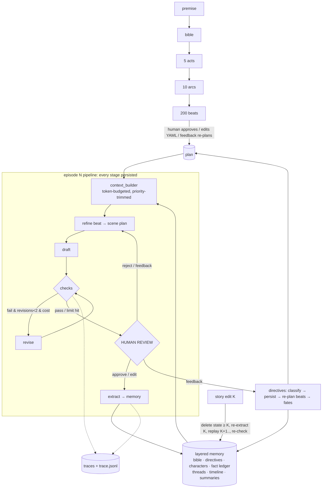

# Serial Writer — an agentic 200-episode story writer with a human in the loop

`story` plans a 200-episode serial (bible → 5 acts → 10 arcs → 200 beats), then writes it one
400–700-word episode at a time. Every draft is self-checked (hard checks, continuity, repetition,
quality judge) and revised at most twice before a human reviews it. Human feedback becomes persistent
**directives** that re-plan future beats, and the system **measures** their effect. Story memory is
layered and event-sourced, so episode 150 gets the same focused context as episode 5, and an edit
to episode 40 can be reconciled through episodes 41–60.

Plain Python state machine. SQLite storage (one file per story), Claude via the Anthropic SDK
(OpenAI is supported as an alternative), `typer` + `rich` CLI.

## 5-minute setup

```bash
cd serial-story-writer
python3.12 -m venv .venv && .venv/bin/pip install -e '.[dev]'   # Python 3.11+
cp .env.example .env            # put your ANTHROPIC_API_KEY in .env
source .venv/bin/activate
story new "A bike courier in 1990s Mumbai finds a ledger of bribes in a dead man's tiffin…"
story write                      # write + review episode 1, then keep going
```

Defaults: `claude-opus-5-5` for planning and drafting, `claude-haiku-4-5` for checks, extraction
and summaries. Every limit is in `serial_writer/config.py` and can be overridden in `.env`.

## Commands

| Command | What it does |
|---|---|
| `story new "<premise>" [--id X] [--yes]` | Bible + hierarchical 200-beat plan, then **plan approval**: page through acts/arcs/beats, `[a]`pprove, `[e]`dit `plan.yaml` in `$EDITOR` (re-validated), or `[f]`eedback → re-plan |
| `story write [--auto N] [--on-fail pause\|approve] [-n K]` | Write the next episode(s) with the review menu. `--auto N` writes N episodes, running all checks, and pauses only on a check failure or a cost cap |
| `story resume <id> [--auto N]` | Continue exactly where it stopped (plan approval, mid-draft, mid-review) |
| `story edit <ep> [--file F] [--option keep\|revise\|regenerate]` | Retroactive edit + downstream reconciliation |
| `story feedback "<text>" [--yes]` | Add a directive outside the review loop (classify → store → re-plan beats → diff for approval) |
| `story show plan\|arc N\|characters\|threads\|facts [--subject]\|directives\|episode N` | Inspect plan and memory |
| `story directives [--impact] [--md F]` | Every directive, the beats it changed, and the episodes it influenced, with judge adherence scores |
| `story stats [--md F]` | Per-episode cost, tokens, LLM time, revisions, check results, plus totals |
| `story estimate [--md F]` | Cost and time projection for all 200 episodes from measured averages, plus cost levers |
| `story export [--out F]` | Plan + all approved episodes in one Markdown file |
| `story list` | All stories (`*` = current) |

**Review menu** (per episode): `[a]` approve · `[e]` edit in `$EDITOR` (your text becomes canon;
extraction runs on it) · `[r]` reject + reason → regenerate · `[f]` feedback/directive → classify,
persist, re-plan (diff shown), optionally regenerate · `[s]` show memory · `[p]` pause (safe at any point).

## Architecture



| Module | Responsibility |
|---|---|
| `llm.py` | Provider wrapper (Anthropic, OpenAI), retries with backoff, Pydantic-validated JSON with one corrective retry, tokens, cost, latency, run budget, embeddings (OpenAI or local hashed) |
| `planner.py` | Bible, acts, arcs, beats (one call per level, 13 calls total), validation, YAML round-trip, directive re-planning |
| `memory.py` | Event-sourced memory queried **as of episode N**: characters, facts (with supersession), threads, timeline, directives, fates |
| `context_builder.py` | The 9-layer context under a token budget; logs what was included and dropped |
| `writer.py` | Beat → scene plan, draft, revise |
| `checker.py` | Hard checks (code), consistency (LLM), repetition (embeddings + hook variety), rubric judge |
| `extractor.py` | Post-approval extraction; rolling arc summaries every 5 eps; "story so far" at arc ends |
| `directives.py` | Feedback classification, persistence, fates, re-planning, impact report |
| `reconcile.py` | Retroactive edit: delete ≥ K, re-extract K, replay K+1.., re-check, keep/revise/regenerate |
| `pipeline.py` | The per-episode state machine, bounded revision loop, cost caps, commit |
| `hitl.py`, `cli.py` | Terminal UI |
| `prompts/*.md` | Every prompt as a template |

Story folder: `stories/<id>/story.db` (all state), `plan.yaml`, `episodes/ep_NNN.md`, `trace.jsonl`.

## Demo

```bash
scripts/run_demo.sh                    # default premise, or: scripts/run_demo.sh "<your premise>"
```

The script:

1. Creates the full 200-episode plan.
2. Writes episodes 1–4.
3. Intervention 1: *"slow down the romance…"* (pacing directive, re-plans beats).
4. Writes episodes 5–8.
5. Intervention 2: *"kill off X by episode 11"* (character fate scheduled, beats re-planned).
6. Writes episodes 9–12, then exits.
7. Runs **`story resume`** in a fresh process and continues to episode 15.
8. Copies everything into `demo/`: `plan.yaml`, `episodes/`, `directives.md` (each intervention,
   the beats it changed, and the later episodes it influenced with adherence scores), `trace.jsonl`,
   `stats.md`, `estimate.md`, `story.md`.

The demo uses `--on-fail approve` so it runs unattended. An episode that still fails checks after
two revisions is approved, and that decision is recorded in the trace as
`auto-approved WITH open issues`. Interactive use pauses for a human instead.

To test a retroactive edit live: `story edit 6`, change a fact (for example, kill someone or rename
a place), save, and look at the downstream conflict table for episodes 7+.

## Tests

```bash
.venv/bin/pytest -q
```

The tests use a deterministic fake provider; it exists only in the tests, never in the main path.
They cover:

- The context budget is respected, and the bible, directives and beat are never dropped.
- Hard checks catch a dead character acting alive, a word count outside 400–700, a timeline going
  backwards, and misspelled or undeclared characters.
- A directive created at ep 5 is in the context at ep 10, and scoped directives expire.
- A kill directive re-plans beats and schedules the fate.
- Resume works after a crash mid-episode (no re-draft) and mid-review.
- A retroactive edit removes and replays derived state for episodes ≥ K, and `regenerate` discards
  later episodes.
- Rejection with a reason leads to regeneration.
- The revision loop is bounded at 2.
- The plan has exactly 200 beats and survives a YAML edit round-trip.

See [DECISIONS.md](DECISIONS.md) for the design rationale and known failure modes.
